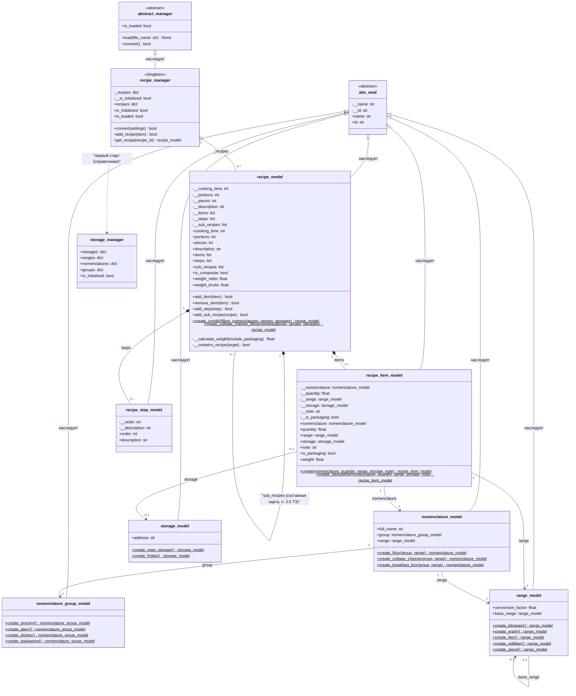

```mermaid
classDiagram
    direction TB

    class abs_mod {
        <<abstract>>
        -__name: str
        -__id: str
        +name: str
        +id: str
    }

    class abstract_manager {
        <<abstract>>
        +load(file_name: str) None
        +convert() bool
        +is_loaded: bool
    }

    class recipe_model {
        -__cooking_time: int
        -__portions: int
        -__pieces: int
        -__description: str
        -__items: list
        -__steps: list
        -__sub_recipes: list
        +cooking_time: int
        +portions: int
        +pieces: int
        +description: str
        +items: list
        +steps: list
        +sub_recipes: list
        +is_composite: bool
        +weight_netto: float
        +weight_brutto: float
        +add_item(item) bool
        +remove_item(item) bool
        +add_step(step) bool
        +add_sub_recipe(recipe) bool
        +create_syrniki(filling, nomenclatures, ranges, storages)$ recipe_model
        +create_cottage_cheese_filling(nomenclatures, ranges, storages)$ recipe_model
        -__calculate_weight(include_packaging) float
        -__contains_recipe(target) bool
    }

    class recipe_item_model {
        -__nomenclature: nomenclature_model
        -__quantity: float
        -__range: range_model
        -__storage: storage_model
        -__note: str
        -__is_packaging: bool
        +nomenclature: nomenclature_model
        +quantity: float
        +range: range_model
        +storage: storage_model
        +note: str
        +is_packaging: bool
        +weight: float
        +create(nomenclature, quantity, range, storage, note)$ recipe_item_model
        +create_packaging(nomenclature, quantity, range, storage, note)$ recipe_item_model
    }

    class recipe_step_model {
        -__order: int
        -__description: str
        +order: int
        +description: str
    }

    class recipe_manager {
        <<Singleton>>
        -_recipes: dict
        -__is_initialized: bool
        +convert(settings) bool
        +add_recipe(item) bool
        +get_recipe(recipe_id) recipe_model
        +recipes: dict
        +is_initialized: bool
        +is_loaded: bool
    }

    class storage_manager {
        +storages: dict
        +ranges: dict
        +nomenclatures: dict
        +groups: dict
        +is_initialized: bool
    }

    class nomenclature_model {
        +full_name: str
        +group: nomenclature_group_model
        +range: range_model
        +create_flour(group, range)$ nomenclature_model
        +create_cottage_cheese(group, range)$ nomenclature_model
        +create_breakfast_box(group, range)$ nomenclature_model
    }

    class nomenclature_group_model {
        +create_grocery()$ nomenclature_group_model
        +create_dairy()$ nomenclature_group_model
        +create_dishes()$ nomenclature_group_model
        +create_packaging()$ nomenclature_group_model
    }

    class range_model {
        +conversion_factor: float
        +base_range: range_model
        +create_kilogram()$ range_model
        +create_gram()$ range_model
        +create_liter()$ range_model
        +create_milliliter()$ range_model
        +create_piece()$ range_model
    }

    class storage_model {
        +address: str
        +create_main_storage()$ storage_model
        +create_fridge()$ storage_model
    }

    abs_mod <|-- recipe_model : наследует
    abs_mod <|-- recipe_item_model : наследует
    abs_mod <|-- recipe_step_model : наследует
    abs_mod <|-- nomenclature_model : наследует
    abs_mod <|-- nomenclature_group_model : наследует
    abs_mod <|-- range_model : наследует
    abs_mod <|-- storage_model : наследует
    abstract_manager <|-- recipe_manager : наследует

    recipe_model "1" *-- "0..*" recipe_item_model : items
    recipe_model "1" *-- "0..*" recipe_step_model : steps
    recipe_model "1" *-- "0..*" recipe_model : "sub_recipes (составная карта, п. 2.5 ТЗ)"

    recipe_item_model "1" --> "1" nomenclature_model : nomenclature
    recipe_item_model "1" --> "1" range_model : range
    recipe_item_model "0..1" --> "0..1" storage_model : storage

    nomenclature_model "1" --> "1" nomenclature_group_model : group
    nomenclature_model "1" --> "1" range_model : range
    range_model "0..1" --> "0..1" range_model : base_range

    recipe_manager "1" o-- "0..*" recipe_model : _recipes
    recipe_manager ..> storage_manager : "первый старт (справочники)"
```
