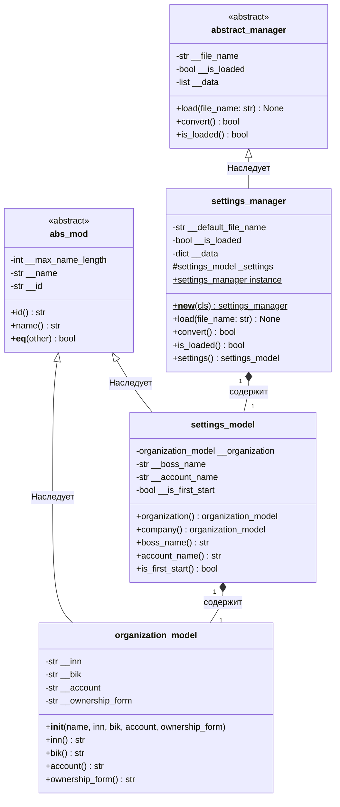

```mermaid
classDiagram
    class abstract_manager {
        <<abstract>>
        -str __file_name
        -bool __is_loaded
        -list __data
        +load(file_name: str) None
        +convert() bool
        +is_loaded() bool
    }

    class settings_manager {
        -str __default_file_name
        -bool __is_loaded
        -dict __data
        #settings_model _settings
        +settings_manager instance$
        +__new__(cls)$ settings_manager
        +load(file_name: str) None
        +convert() bool
        +is_loaded() bool
        +settings() settings_model
    }

    class abs_mod {
        <<abstract>>
        -int __max_name_length
        -str __name
        -str __id
        +id() str
        +name() str
        +__eq__(other) bool
    }

    class settings_model {
        -organization_model __organization
        -str __boss_name
        -str __account_name
        -bool __is_first_start
        +organization() organization_model
        +company() organization_model
        +boss_name() str
        +account_name() str
        +is_first_start() bool
    }

    class organization_model {
        -str __inn
        -str __bik
        -str __account
        -str __ownership_form
        +__init__(name, inn, bik, account, ownership_form)
        +inn() str
        +bik() str
        +account() str
        +ownership_form() str
    }

    abstract_manager <|-- settings_manager : Наследует
    abs_mod <|-- settings_model : Наследует
    abs_mod <|-- organization_model : Наследует

    settings_manager "1" *-- "1" settings_model : содержит
    settings_model "1" *-- "1" organization_model : содержит
```