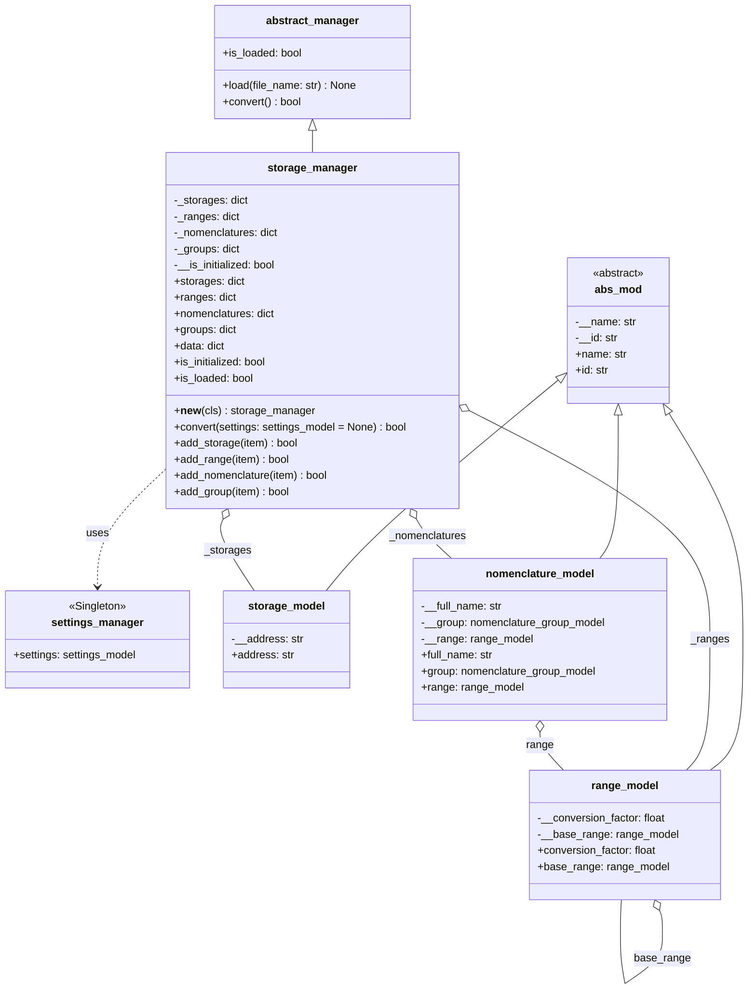

```mermaid
classDiagram
    direction TB

    class abstract_manager {
       
        +load(file_name: str) None
        +convert() bool
        +is_loaded: bool
    }

    class storage_manager {
        
        -_storages: dict
        -_ranges: dict
        -_nomenclatures: dict
        -_groups: dict
        -__is_initialized: bool
        +__new__(cls) storage_manager
        +convert(settings: settings_model = None) bool
        +add_storage(item) bool
        +add_range(item) bool
        +add_nomenclature(item) bool
        +add_group(item) bool
        +storages: dict
        +ranges: dict
        +nomenclatures: dict
        +groups: dict
        +data: dict
        +is_initialized: bool
        +is_loaded: bool
    }

    class settings_manager {
        <<Singleton>>
        +settings: settings_model
    }

    class storage_model {
        -__address: str
        +address: str
    }

    class range_model {
        -__conversion_factor: float
        -__base_range: range_model
        +conversion_factor: float
        +base_range: range_model
    }

   

    class nomenclature_model {
        -__full_name: str
        -__group: nomenclature_group_model
        -__range: range_model
        +full_name: str
        +group: nomenclature_group_model
        +range: range_model
    }

    class abs_mod {
        <<abstract>>
        -__name: str
        -__id: str
        +name: str
        +id: str
    }

    abs_mod <|-- storage_model
    abs_mod <|-- range_model
   
    abs_mod <|-- nomenclature_model

    abstract_manager <|-- storage_manager

    storage_manager o-- storage_model : _storages
    storage_manager o-- range_model : _ranges
   
    storage_manager o-- nomenclature_model : _nomenclatures

    storage_manager ..> settings_manager : uses

    
    nomenclature_model o-- range_model : range
    range_model o-- range_model : base_range
```