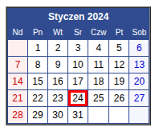

# Письмо

`Привет, бро!` 

Я начал новый проект связанный с автоматизацией сети ресторанов и кафе. Проект `очень - очень` интересный и сложный. Для реализации данного проекта я сейчас собираю команду. Каждого члена команды я должен утвердить у нашего **Заказчика**. Предверительное [техническое задание](../readme.md) уже согласованою. Заказчик очень придирчивый и каждому кандидату выдает задание и далее проводит оценку выполнения данного задания каждым кандидатом.
Высылаю тебе данное задание и я **очень на тебя** рассчитываю!

|      |
|------|
|
|      |

Вам необходимо:
- Дописать программу. Сделать выгрузку календаря в формат HTML, в файл. Наименование файла должен определять `Заказчик` (произвольное), но расширение - строго HTML
- Сделать календарь на русском языке по умолчанию. Так же, добавить разные языки: `английский`, `немецкий`. В перспективе, язык должен настраиваться.
- Календарь должен отображаться в **зависимости от языка**. Если русский, то начинаться с понедельника, если западный язык, то с воскресенья, как сейчас.
- Суббота и воскресенье должны отмечаться **одним цветом**. Фон светло красный, а цвет текста - ярко красный. Праздник (23 февраля, 8-е марта и прочее) должен отображаться синим цветом и светло синим фоном. Праздники выводятся в зависимости от выбранного языка.
Календарь должен формироваться за любой указанный месяц Заказчиком.
- **Запрещено** полностью переписывать код. Необходимо сделать доработку в текущей архитектуре.

[main.py](main.py)  

**Удачи, бро!**

